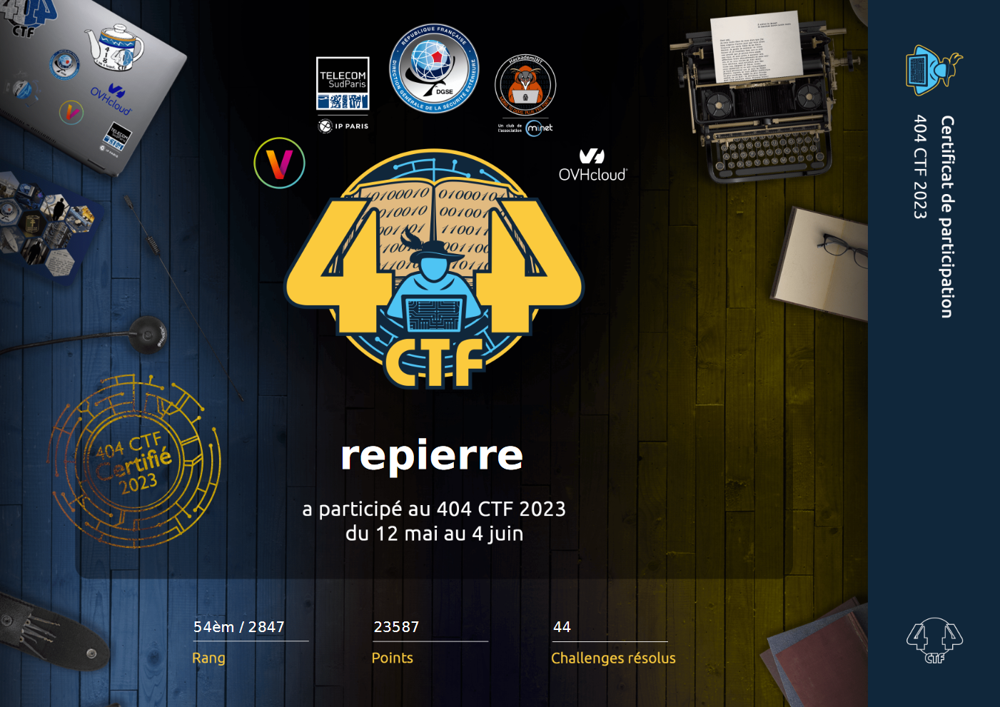

# My 404CTF-2023's writeups

[404CTF](https://www.404ctf.fr/) lasted 3 weeks from May, 12th to June, 4th. 
Sources files and *official* writeups are available on [their github](https://github.com/HackademINT/404CTF-2023).

## Categories

Challenges were divided in several categories:
- [Forensic analysis](forensics/README.md)
- [Cloud](cloud/README.md)
- [Cryptanalysis](cryptanalysis/README.md)
- [Misc](misc/README.md)
- [Binary exploitation](pwn/README.md)
- AI
- [Programming](programming/README.md)
- [Radiofrequency](rf/README.md)
- [OSINT](osint/README.md)
- [Reverse engineering](reverse/README.md)
- [Steganography](steganography/README.md)
- [Hardware](hardware/README.md)
- [Web](web/README.md)
- [Web3](web3/README.md)

## My results

