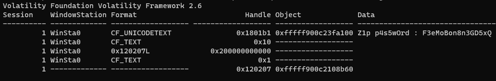

# Lettres volatiles

> Une femme regarde avec hésitation une table à l'autre bout du café Le Procope, au milieu des conversations de fond des habitués. Sur cette table, un ordinateur allumé est laissé à l'abandon.
>
> ARSINOÉ 
> *à part* 
> Vais-je réellement croissanter mon amie ? 
> Je m'en voudrais longtemps, même si c'est permis. 
> Cela suffit. Il est grand temps que je m'élance. 
> De Célimène, je vais trahir la confiance. 
>
> ARSINOÉ 
> *prenant les commandes de la machine* 
> Il semble que quelques intéressants fichiers 
> Soient protégés par quelque magie noire. 
> Célimène garde vraiment bien ses secrets. 
> Il va alors falloir capturer sa mémoire. 
>
> Arsinoé s'exécute en vitesse, et récupère le répertoire utilisateur de Célimène dans une clé. À vous d'y récupérer le secret.
>
> MD5 C311M1N1.zip : a22df7724c02691d12ef1451fb83bf3a

After downloading and unzipping the file we indeed have a Windows user's directory:

I first looked in the usual places: documents, downloads, desktop, pictures.
In those directories I found a bunch of interesting files:
- `s3cR37.zip`: A zip file containing a pdf but password protected.
- `JumpBag` folder: the tool used to dump the memory, it contains the memory dump named `C311M1N1-PC-20230514-200525.raw`.
- `fl4g.svg` & `flag.png`: pictures of the CTF's logo

At this point I was pretty sure the flag was in the PDF inside `s3cR37.zip` but I didn't have it's password.
I first thought of multiple places to look for the password:
- Inside the flags pictures, hidden using steganography.
- Look in the memory capture for either the clear PDF file loaded in some reader or the password in an opened text file

After comparing signatures of the pictures, I focused on the memory dump (why would it be there if the password was in the pictures?). 
I tried looking in many of the opened processes: explorer, firefox, notepad but none contained anything usefull. 
At that point I had used every Volatility 3 plugins on this dump without getting anything usefull, but I remembered from the recent FCSC CTF that some Vol2 plugins weren't ported to Vol3 yet, especially the `clipboard` plugin. 
So I ran it against the memory dump and voila:

The zip password was `F3eMoBon8n3GD5xQ`. 
After opening the PDF, we get a barely readable letter finished by some really interesting string... THE FLAG!

Flag: `404CTF{V0147i1I7y_W1Ll_N3v3r_Wr8_loV3_l3ttEr5}`