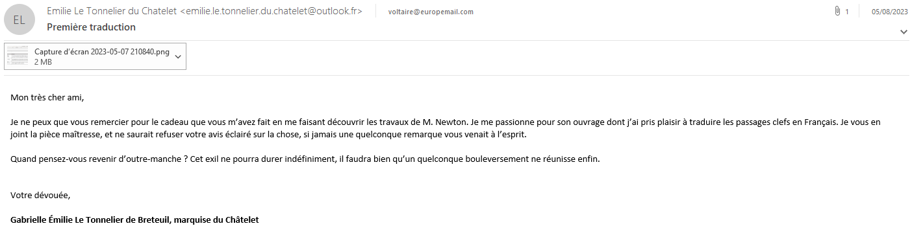
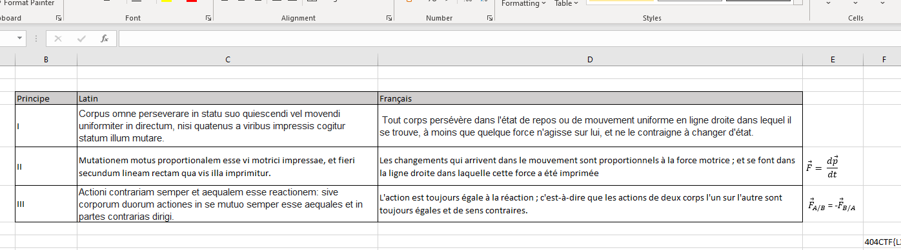
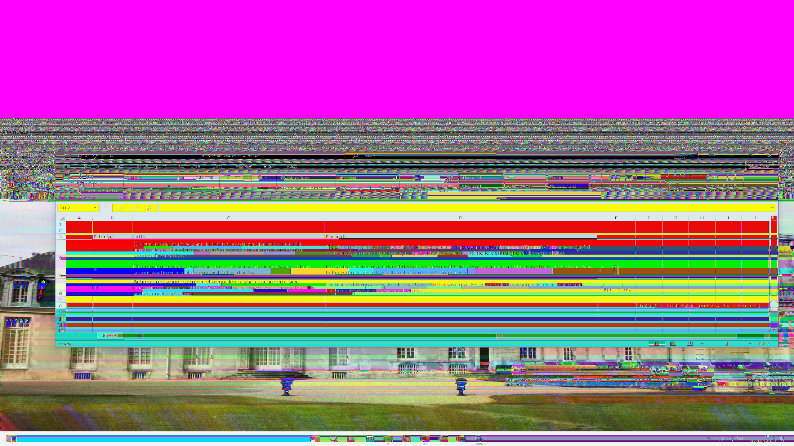

# Note de bas de page

> En tendant l'oreille dans le salon, votre attention est captée par une conversation particulière. Là où les alentours dissertent sur des sujets de procédés littéraires toujours plus avancés, celle-ci semble en effet plutôt porter sur la philosophie naturelle. Vous vous approchez par curiosité, lorsque la marquise du Châtelet, alors en pleine explication des travaux d'un certain Leibniz, s’interrompt et vous interpelle :
>
> « Vous me voyez ravie de vous rencontrer ici ! Nous n'avons pas eu la chance de nous rencontrer, mais on m'a parlé de vous et l'on m'a assuré que vous étiez formidable lorsqu'il s’agissait de retrouver les choses perdues. Voyez, j'ai travaillé il y a peu sur un projet qui me tient à cœur, et j'ai bien peur d'avoir perdu le fruit de mon travail par un triste accident. Heureusement, j'avais échangé à ce sujet avec un ami proche, et il est bien possible que notre correspondance ait gardé la trace d'une note de bas de page que je souhaiterais tout particulièrement retrouver. Auriez vous l’amabilité de m'assister dans ma mésaventure ? »
>
> Aidez la marquise à retrouver la note qu'elle a perdue grâce à une sauvegarde de ses correspondances.

In this challenge we are given a `backup.pst` file. According to file, it's an Outlook email folder.
Given that I have outlook on my computer, I just opened the file in it and was given a full copy of a the mail folders of Emilie. 
Looking in them I found a mail sent to Voltaire with a screenshot attached to it:

The screenshot attached to the mail:

In the screenshot we can see something really interresting: `404CTF{L` but the full text is cropped. 
It was pretty clear my goal was to recover the full screenshot, but how can we recover it since it was cropped? 
Well, I remembered seeing on Twitter some posts about a vulnerability in [Windows snipping tool](https://twitter.com/David3141593/status/1638222624084951040) allowing to recover the full screenshot.
I downloaded an ran hist script but the result was...bad:

Initially, I work with this version of the picture, separating in Photoshop the color layers to read the flag and after multiple tries I got the correct flag.

However, after discussing with the author the challenge, I decided to edit the script to recover RGBa pngs (Windows 11 screenshots are RGBa but the original script uses RGB): [RGBA version of the script](https://gist.github.com/21repierre/9b1626b12b8f51f91361bd40f98302f8).

And a better screenshot:
[Good result](pictures/notes-en-bas-de-page-recover-2.png)

Flag: `404CTF{L3_f0rM1d@bl3_p09re35_d3s_lUm13re5}`