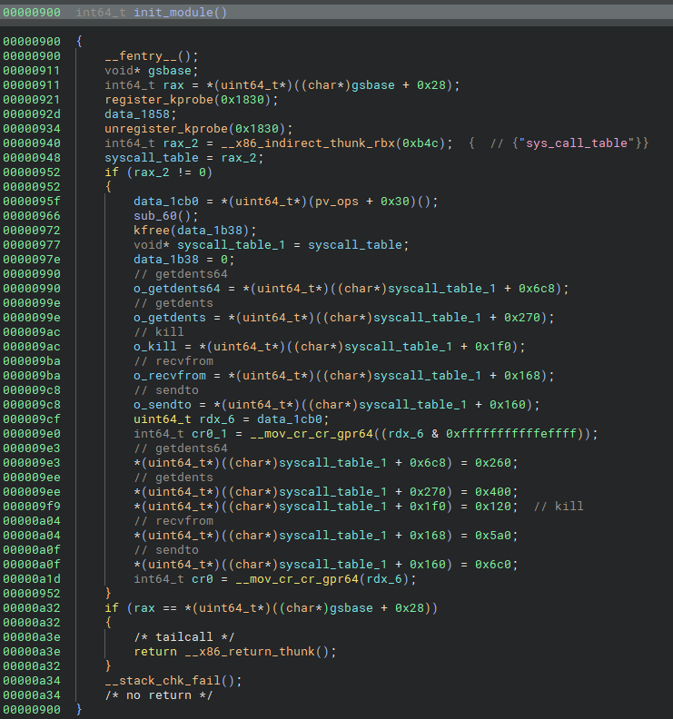

# Poids Raw vs. Cours Jette

## Challenge

- Difficulty: difficult
- Value:  989 pts
- Authors: @OwlyDuck & @Lowengeist
- Files: memory.7z

> Cette série de challenges implique un scénario d'attaque mettant en œuvre des programmes qui peuvent potentiellement nuire à vos équipements, nous faisons appel à votre vigilance pour toute forme d'analyse dynamique
>
>
> Bienvenue chez Entreprendre !
>
> Nous sommes une entreprise jeune et dynamique spécialisée dans les poids. Si vous appréciez observer des boulets se projeter, enfin se faire projeter, venez lancer les nôtres !
>
> Nous avons remarqué une perte de réseau récemment et il semblerait que le switch feuille3 ait redémarré pour des raisons inexplicables. Notre responsable du réseau a investigué mais rien trouvé d'étrange. Dans le doute, il a fait une capture de RAM du switch et vous désigne vous, oui vous, pour trouver ce qui cloche.
>
> Nous pensons qu'il s'agit là d'un coup de nos rivaux : Imagine... Ces derniers travaillent dans le lancer de javelot, une discipline hérétique et vulgaire qui nous écœure ! Nous aurions dû faire attention et mettre des mots de passe plus forts sur nos équipements !
>
>Trouvez le pid et le hash md5 du malware présent sur le switch
>
> Format du Flag : 404CTF{111:891f490e5d7bdb06d90d56f8d7db405f}

## Writeup

After extracting the archive, we have a `memory.elf` file, which is the memory dump from the switch. I used volatility 2 and 3 to analyze it, although the final step was impossible using vol3.
The first thing to do to analyze a linux memory dump using volatility is to build a profile containing important kernel offsets so that volatility, and its plugins, are able to parse the file.

### Building a profile

To build a profile, I needed a live station running the exact same linux version as the one ine the dump. Looking through the strings in the dump, I identified this line which gave me the informations I needed:
```
5.10.0-cl-1-amd64 (dev-support@cumulusnetworks.com) (gcc-8 (Debian 8.3.0-6) 8.3.0, GNU ld (GNU Binutils for Debian) 2.31.1) #1 SMP Debian 5.10.189-1+cl5.8.0u16 (2024-01-27)
```
Cumulus Networks is an Nvidia company and they make public VM image of the cumulus switch OS. I downloaded it, along another vanilla Debian 8.3 VM (because I couldn't figure out how to connect the Cumulus VM to the internet).
Then I just built the Golang dwarf tool and ran it on the Cumulus VM to make the vol3 profile.
I used the [volatility/tools/linux](https://github.com/volatilityfoundation/volatility/tree/master/tools/linux) to make the profile for vol2.

### Finding the malware

Skimming through the running processes gave me this:

```bash
$ /opt/volatility/vol.py --profile=LinuxCumulusx64 -f memory.elf linux_psaux
Volatility Foundation Volatility Framework 2.6.1
Pid    Uid    Gid    Arguments
1      0      0      /sbin/init
[...]
3022   1000   1000   -bash
3089   0      0      /usr/bin/python2 /usr/sbin/smond
3095   0      0      /usr/bin/python2 /usr/sbin/ledmgrd
3096   0      0      /usr/bin/python2 /usr/sbin/pwmd
3187   0      0      /sbin/dhclient -pf /run/dhclient.eth0.pid -lf /var/lib/dhcp/dhclient.eth0.leases eth0
3306   109    113    lldpd: monitor.
3310   0      0      /usr/bin/python -O /usr/sbin/netd -d
3313   0      0      /usr/sbin/ptmd -l INFO
3314   0      0      /sbin/agetty -o -p -- \u --keep-baud 115200,57600,38400,9600 ttyS0 vt220
3316   0      0      /bin/bash /usr/lib/cumulus/sysmonitor
3317   0      0      /usr/share/venvs/netq-apps/bin/python /usr/sbin/netqd --daemon
3321   0      0      sshd: /usr/sbin/ss
3334   0      0      /usr/lib/frr/watchfrr -d -F datacenter zebra staticd
3352   109    113    lldpd: no neighbor.
3356   0      0      /usr/bin/python3 /usr/bin/neighmgrd
3397   110    118    /usr/lib/frr/zebra -d -F datacenter -M cumulus_mlag -M snmp -A 127.0.0.1 -s 90000000
3460   110    118    /usr/lib/frr/staticd -d -F datacenter -A 127.0.0.1
5226   0      0      nginx: master process /usr/sbin/nginx -g daemon o
5227   33     33     nginx: worker process
5228   33     33     nginx: worker process
6985   0      0      /usr/bin/anssible
8065   0      0      sleep 60
8119   1000   1000   less
```

We can see a lot of processes related to networking (`frr`), but one process is a little strange: `anssible`.
Its name looks like the automation tool `ansible` but nothing comes up when searching for it online.

After dumping it, I looked at the strings in the file:
```
pcap_create
pcap_breakloop
pcap_activate
pcap_loop
[...]
sendto
read
[...]
/usr/lib/modules/5.10.0-cl-1-amd64/kernel/drivers/net/anssible.ko
```
So we have: 
- PCAP library, probably to listen to the interfaces
- socket usage, probably to communicate with a C2
- A kernel module

This looks awfully like a rootkit.
Anyway we have our malware so here is the 1st flag: `404CTF{6985:64c6c973e790d526486b874c95a1ef47}`


### Malware analysis

> Unfortunatly, I couldn't go through the whole process of reversing it and finding the 2nd flag but I will share anyway my findings.

I had 0 experience of linux malware and at the beggining I didn't even know it was a rootkit. Fortunatly, a few days prior to this, a colleague of mine talked about [Diamorphine](https://github.com/m0nad/Diamorphine), a linux rootkit, and I had looked at its capabilities and how it performed his actions (in fact I read a bunch of other articles about linux rootkit to understand what it was doing).

Going back to our challenge, I also dumped the kernel module to analyze it, so let's start with it.

#### The `init_module` function
The `init_module` function is called when the kernel module is loaded:


Given what I learned, it was pretty clear that it was altering the syscall table to replace the handlers to some syscall functions.
Just by divinding the offsets by 8 and looking at a [syscall table](https://chromium.googlesource.com/chromiumos/docs/+/master/constants/syscalls.md), I identified these syscalls:

- 0x6c8 $\Rightarrow$ `getdents64`: used to read and parse directories
- 0x270 $\Rightarrow$ `getdents`: used to read and parse directories
- 0x1f0 $\Rightarrow$ `kill`: used to send signals to programs
- 0x168 $\Rightarrow$ `recvfrom`: used to receive data from socket
- 0x160 $\Rightarrow$ `sendto`: used to send data to a socket

#### The `kill` syscall

From `Diamorphine`, I learned that kill is usually used to hide processes and even give them root permissions.
This is exactly what is done here:
- `kill 64` gives root privileges to the calling process
- `kill 31` hides the process (it is invisible from something like `ps aux`)
- `kill 63` I couldn't identify what it did

#### The `recvfrom` syscall

Becaus the originals offsets of the syscalls were saved, the rootkit is able to call the real `recvfrom` syscall and use this result before giving it back to caller.

After getting the data from the original call, this function check wheter the caller's process is hidden (see `kill 31`), if not it just return the data, acting like a normal recvfrom.
Otherwise, it performs a xor of the data using the key `0xdeadbeefcafebabe` (I am not sure about that part but this is what I understood) before returning the xored data.

#### The `getdents`/`getdents64` syscalls

From what I have understood, It will remove each entries that contains `anssible` if the calling process isn't hidden.

#### The `sendto` syscall

I haven't had the time to look at it.


From that we have a good guess of what the rootkit is capable of, now let's look at the malware itself.

#### The `main` function (`0x555555557ea1`)

```c
0x555555557eb0      int32_t rax = getpid();
0x555555557eb5      pid = rax;
0x555555557ec2      if (rax == 0)
0x555555557ec2      {
0x555555557ed1          kill(((uint64_t)pid), 31);
0x555555557edb          exit(0);
0x555555557edb          /* no return */
0x555555557ec2      }
0x555555557ee5      wait(nullptr);
```

The `main` starts by forking itself and calling `kill 31`, which is intercepted by the rootkit and hides the process.

The next thing it does is checking the size of the `/usr/lib/modules/5.10.0-cl-1-amd64/kernel/drivers/net/anssible.ko` file, probably to ensure the rootkit hasn't been tampered with.

It will then bind a UDP socket on port 31337 (👀) and wait for incomming connections in function at offset `0x555555557c88`.

#### The receiving function

After receiving data in a buffer (max len is 93), it performs some operations on the received data.
Thanks to the math classes I took a few years ago, I easily recognized partial [Taylor expansion](https://en.wikipedia.org/wiki/Taylor_series) sums of common functions: $\cos$, $\sin$, $\arccos$.

This is the part that lost me, after summing $\cos^2{(a * (\text{buf}_i + k_i))} + \sin^2{(a * (\text{buf}_i + k_i))} = 1$ where $a=0.0074799825085471268$ and $k$ is an internal buffer to 

$$
\sum_{ i = \text{nreceived} }^{ \text{0x678acf} }{ \cos^2{(a * k_i) } + \sin^2{ (a * k_i)} } = \text{0x678acf} - \text{nreceived} + 1
$$

it verifies that this value is equal to $\text{0x678ad0}$ and that $\text{nreceived} \geq 30$ which should always be true but wasn't during my tests.

It will then do another check on the received buffer using the same kind of logic.
If those checks pass, th received buffer will be used as a key to decrypt some data, then assemble some C code, compile it using [tcc](https://bellard.org/tcc/), write it to memory, and allow code execution from memory.


### Conclusion

I wasn't really able to go much further but overall, I learned a lot of things about linux rootkits and their inner mechanisms, so thank you to both authors of this challenge!
