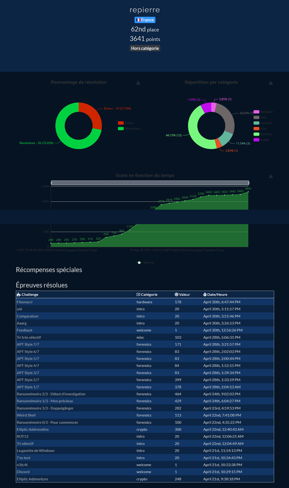
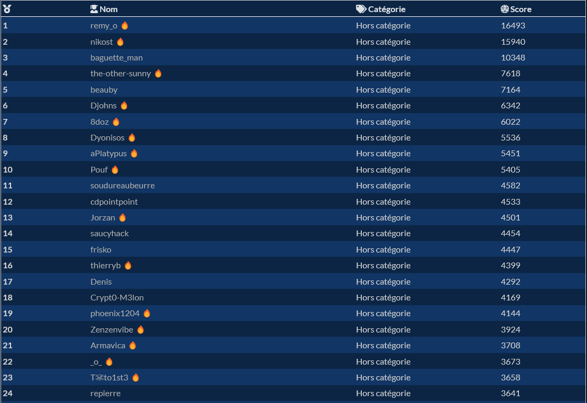
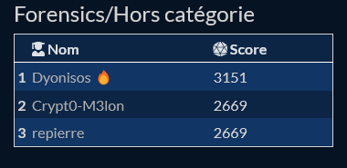

# FCSC 2023 write-ups
[FCSC 2023](https://www.france-cybersecurity-challenge.fr/) (France Cybersecurity Challenge) is a CTF held from April 21 to April 30 2023 including different types of challenges:
- misc
- Side Channel and Fault Attacks
- crypto
- forensics
- reverse
- hardware
- pwn
- web
- intro
- welcome

# My results
- 62th out of 1364 participants

- 24th out of 614 "Hors-catégorie"

- 3rd of "Hors-catégorie"/Forensics 
