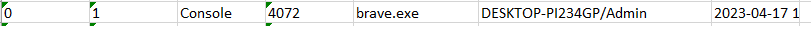
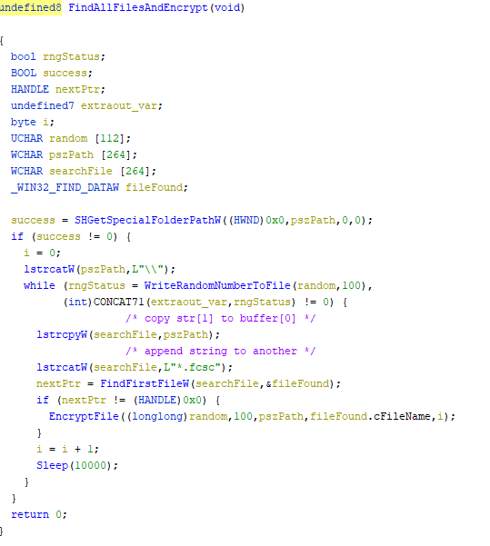
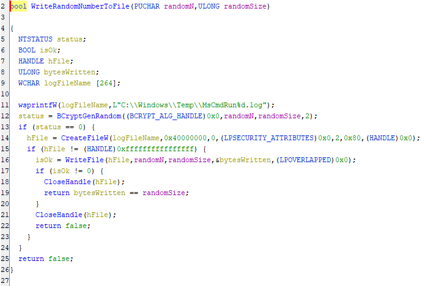

# Ransomémoire 0/3 - Pour commencer

Vous vous préparez à analyser une capture mémoire et vous notez quelques informations sur la machine avant de plonger dans l'analyse :
- nom d'utilisateur,
- nom de la machine,
- navigateur utilisé.

Le flag est au format FCSC{\<nom d'utilisateur\>:\<nom de la machine\>:\<nom du navigateur\>} où :
- \<nom d'utilisateur\> est le nom de l'utilisateur qui utilise la machine,
- \<nom de la machine\> est le nom de la machine analysée et
- \<nom du navigateur\> est le nom du navigateur en cours d'exécution.

Par exemple : FCSC{toto:Ordinateur-de-jojo:Firefox}.

Attention : pour cette épreuve, vous n'avez que 10 tentatives de flag.

SHA256(fcsc.7z) = 754cb093af343356827d650270f9faa56cc4c44f44243ea08590edb1bc270b5e

## Solution
Using volatility3 on the memory dump, I obtained the process list:

So the flag is: ```FCSC{Admin:DESKTOP-PI234GP:Brave}```

# Ransomémoire 1/3 - Mon précieux

Vous étiez en train de consulter vos belles photos de chats quand patatra, votre fichier super secret sur votre Bureau change d'extension et devient illisible...

Vous faites une capture mémoire pour comprendre ce qu'il s'est passé, dans le but de récupérer ce précieux fichier.

## Solution
I used MemProcFS to find the file because I had no results with vol3.
### The file
In the MFT record, I found a file called ```flag.fcsc.enc``` under ```\Users\Admin\Desktop``` and fortunatly it was small enough to get be written there.

### Decryption
With *findevil*'s analysis, I found some interresting things:
- DLL injection in ```VBoxTray.exe```
- ```VBoxTray.exe``` started ```C:\Windows\Temp\svchost.exe```

Then I analysed the ```svchost.exe``` file in Ghidra.
I found 3 functions related to the file:




The first one will look for every file called like ```*.fcsc```, and call ```writeRandomNumberToFile``` and ```encryptFile```.<br>
```writeRandomNumberToFile``` will generate a random 100 bytes number and save it under ```C:\Windows\Temp\MsCmdRun%d.log```.<br>
```encryptFile``` will use the i-th random number to encrypt the i-th file using a basic xor: 
```c
fileBuffer[j] ^= (randomN[j]) ^ i
```
I then tried to decrypt it using every MsCmdRun log file until I find one starting with ```FCSC{```. You can find my script as ```decrypt.py``` which give ```FCSC{776f25d811bf9ac262143d0f1fa97c382f7b5972121b37d0361c7d7ad1b27079}```.

# Ransomémoire 2/3 - Début d'investigation

Ouf, vous avez pu récupérer votre précieux fichier. Vous enquêtez maintenant sur l'origine de ce chiffrement.

Le flag est au format FCSC{\<pid\>:\<protocole\>:\<port\>} où :
- \<pid\> est l'ID du processus qui a déposé et exécuté le chiffreur et
- \<protocole\> et \<port\> sont les paramètres de la connexion avec le C2.

## Solution

We already know the process which delivered ```svchost.exe```, it's ```VBoxTray.exe``` (pid: 6424).<br>
The I used ```strings``` on the memory dump of the process and found ```tcp://:8080```.<br>
The flag is ```FCSC{6424:tcp:8080}```.

# Ransomémoire 3/3 - Doppelgänger

Vous ne comprenez pas comment l'agent que vous avez trouvé dans Ransomémoire 2/3 - Début d'investigation a pu se retrouver sur la machine (Note : il n'est pas nécessaire d'avoir résolu ce challenge pour résoudre Ransomémoire 3/3 - Doppelgänger). Vous suspectez la présence d'un agent dormant, qui se cache en mémoire...

Le flag est au format FCSC{\<pid\>:\<ip\>:\<port\>} où :
- \<pid\> est l'ID du processus malveillant et
- \<ip\> et \<port\> sont les paramètres de la connexion avec le C2.

## Solution

Something else ```findevil``` reported was Brave with read/write/execute (RWX) pages in the page table.
I crosschecked with vol3's netstat plugin and found connected on ```192.168.1.106:443```, a private IP address.
FLAG: ```FCSC{6808:192.168.1.106:443}``` 

# Conclusion

It was a really cool introduction to digital forensics, I discovered some really cool tools :) and learned a lot.<br>
Huge thanks to the FCSC's staff for putting up this challenge.  